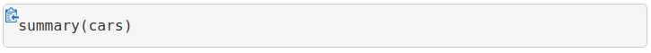

<!-- README.md is generated from README.Rmd. Please edit that file -->


```{r setup, include=FALSE}
knitr::opts_chunk$set(echo = TRUE)
```

# klippy: Copy to Clipboard Buttons for R Markdown HTML Documents

**klippy** enhances R Markdown HTML documents with **"copy to clipboard" buttons** as shown below:



## Installation

`klippy` is not available from CRAN, but you can install the development version from GitHub with:

```{r, eval = FALSE}
# install.packages("devtools")
devtools::install_github("RLesur/klippy")
```

## Motivation

As an intensive reader of R Markdown books and documents (thanks to `knitr`), I selected on my screen dozens of R code blocks then press `Ctrl+C`...  
This package is a very small, but I hope helpful add-in for R Markdown to improve the reader experience.

## Usage

Add the following chunk anywhere in your `Rmd` file:

````markdown
`r ''````{r klippy, echo=FALSE, include=TRUE}
klippy::klippy()
```
````

## Browser Support

For supported browsers, see [`clipboard.js` documentation](https://clipboardjs.com/#browser-support).

## Bugs/Feature requests

If you have any, [let me know](https://github.com/RLesur/klippy/issues). Thanks!

## Related project

To use `clipboard.js` in Shiny, see `rclipboard` ([CRAN](https://cran.r-project.org/package=rclipboard), [GitHub](https://github.com/sbihorel/rclipboard)).

## Credits

The following libraries are distributed with `klippy`:

**clipboard.js** (version: 1.7.1) (c) Zeno Rocha <hi@zenorocha.com>  
MIT license: http://zenorocha.mit-license.org/  
Website: https://clipboardjs.com/  
GitHub: https://github.com/zenorocha/clipboard.js/ 

**jQuery** (version: 1.11.3) (c) jQuery Foundation, Inc.  
MIT license: https://jquery.org/license/  
Website: https://jquery.com/

**Bootstrap** (version: 3.3.5) (c) Twitter, Inc.  
MIT license: https://github.com/twbs/bootstrap/blob/v3.3.5/LICENSE  
Website: http://getbootstrap.com

