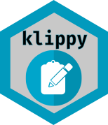
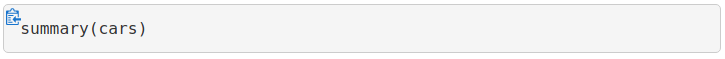

<!-- README.md is generated from README.Rmd. Please edit that file -->

# klippy<br />Copy to Clipboard Buttons for R Markdown HTML Documents<a href="https://rlesur.github.io/klippy"></a>

<!-- badges: start -->

[](https://travis-ci.org/RLesur/klippy)
<!-- badges: end -->

## Overview

**klippy** enhances R Markdown HTML documents with **“copy to clipboard”
buttons** as shown below:



## Installation

`klippy` is not available from CRAN, but you can install the development
version from GitHub with:

``` r
# install.packages("remotes")
remotes::install_github("rlesur/klippy")
```

## Motivation

As an intensive reader of R Markdown books and documents (thanks to
`knitr`), I selected on my screen dozens of R code blocks then press
`Ctrl+C`…  
This package is a very small, but I hope helpful add-in for R Markdown
to improve the reader experience.

## Usage

Add the following chunk anywhere in your `Rmd` file:

```` markdown
```{r klippy, echo=FALSE, include=TRUE}
klippy::klippy()
```
````

## Browser Support

**klippy** uses [clipboard.js](https://clipboardjs.com/). Tooltips are
rendered with [Primer Tooltips](https://primer.style/) CSS.  
Glue code is in Vanilla JS.  
For supported browsers, see [`clipboard.js`
documentation](https://clipboardjs.com/#browser-support).

## Bugs/Feature requests

If you have any, [let me know](https://github.com/RLesur/klippy/issues).
Thanks\!

## Related project

To use `clipboard.js` in Shiny, see **rclipboard**
([CRAN](https://cran.r-project.org/package=rclipboard),
[GitHub](https://github.com/sbihorel/rclipboard)).

## Credits

The following libraries are distributed with `klippy`:

**clipboard.js** (version: 1.7.1) (c) Zeno Rocha <hi@zenorocha.com>  
MIT license: <https://zenorocha.mit-license.org/>  
Website: <https://clipboardjs.com/>  
GitHub: <https://github.com/zenorocha/clipboard.js/>

**Primer Tooltips** (version: 1.4.0) (c) GitHub, Inc.  
MIT license:
<https://github.com/primer/primer-css/blob/v9.5.0/modules/primer-tooltips/LICENSE>  
Website: <https://primer.style/>

The clipboard icon `clippy.svg` is part of:  
**GitHub Octicons** (version: 6.0.1) (c) GitHub, Inc.  
MIT license: <https://github.com/primer/octicons/blob/v6.0.1/LICENSE>  
Website: <https://octicons.github.com/>
